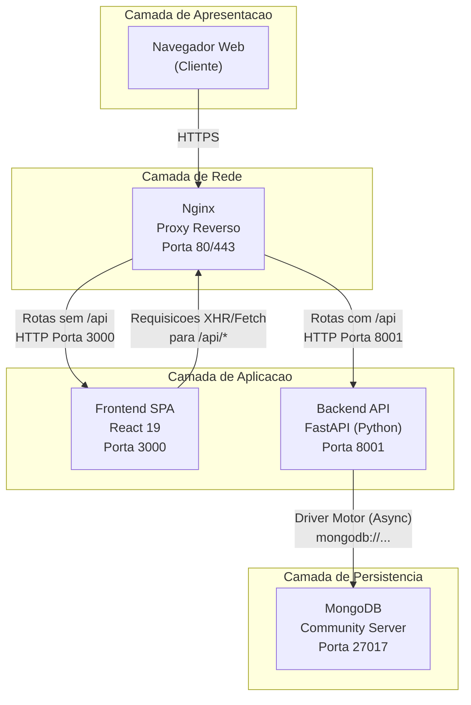
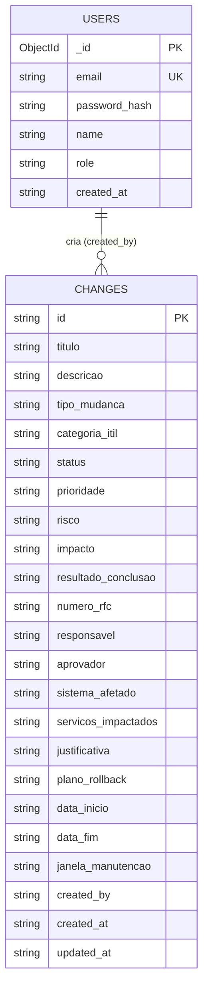

# Documentacao de Arquitetura e Especificacao Tecnica - SGMD

**Servico de Gerenciamento de Mudancas**

| Metadado | Valor |
|---|---|
| **Documento** | HLD - High-Level Design |
| **Sistema** | SGMD - Servico de Gerenciamento de Mudancas |
| **Versao** | 1.0 |
| **Data** | Abril de 2026 |
| **Classificacao** | Uso Interno - DTI |
| **Repositorio** | https://github.com/HyagoKeller/SGMD |

---

## Sumario

1. [Visao Geral da Solucao](#1-visao-geral-da-solucao)
2. [Diagrama e Descricao da Arquitetura](#2-diagrama-e-descricao-da-arquitetura)
3. [Matriz de Requisitos de Software](#3-matriz-de-requisitos-de-software)
4. [Modelo de Dados Conceitual](#4-modelo-de-dados-conceitual)
5. [Especificacao de Integracao](#5-especificacao-de-integracao)
6. [Requisitos de Configuracao Ambiental](#6-requisitos-de-configuracao-ambiental)
7. [Especificacao da API REST](#7-especificacao-da-api-rest)
8. [Politica de Seguranca](#8-politica-de-seguranca)
9. [Requisitos Nao-Funcionais](#9-requisitos-nao-funcionais)
10. [Glossario](#10-glossario)

---

## 1. Visao Geral da Solucao

### 1.1 Proposito

O SGMD (Servico de Gerenciamento de Mudancas) e uma aplicacao web desenvolvida para o Departamento de Tecnologia da Informacao com o objetivo de registrar, classificar, aprovar, acompanhar e auditar mudancas planejadas em ambientes de Tecnologia da Informacao, seguindo as boas praticas do framework ITIL v4 para o processo de Gerenciamento de Mudancas (Change Management).

### 1.2 Valor de Negocio

| Beneficio | Descricao |
|---|---|
| **Visibilidade Operacional** | Calendario visual que consolida todas as mudancas agendadas em multiplas visoes (semanal, mensal, semestral e anual), permitindo a gestao proativa de janelas de manutencao |
| **Prevencao de Conflitos** | Mecanismo automatico de deteccao de sobreposicao de agendamentos, alertando os responsaveis sobre intervencoes concorrentes no mesmo periodo |
| **Rastreabilidade ITIL** | Cada mudanca registra campos normativos como Numero RFC, Categoria ITIL, Prioridade, Risco, Impacto, Plano de Rollback e Resultado da Conclusao, atendendo aos requisitos de auditoria |
| **Classificacao por Dominio** | Segregacao de mudancas por tipo: Infraestrutura, Sistemas e SAPIENS, permitindo filtragem e responsabilizacao por equipe |
| **Exportacao de Dados** | Exportacao em formato CSV para integracao com ferramentas de relatorio e compliance |

### 1.3 Escopo Funcional

- Autenticacao de usuarios (login/registro com credenciais)
- CRUD completo de Registros de Mudanca (RFC)
- Calendario interativo com visoes semanal, mensal, semestral e anual
- Painel de metricas por status (Planejada, Aprovada, Em Execucao, Concluida, Cancelada)
- Painel de metricas por tipo (Infraestrutura, Sistemas, SAPIENS)
- Detalhamento de mudancas concluidas com resultado (Sucesso, Com Ressalvas, Sem Sucesso/Rollback)
- Deteccao e alerta de conflitos de agendamento
- Filtros por status e por tipo de mudanca
- Exportacao de dados em CSV
- Seed automatico de usuario administrador na inicializacao

---

## 2. Diagrama e Descricao da Arquitetura

### 2.1 Padrao Arquitetural

O SGMD segue o padrao **Cliente-Servidor Web** com separacao clara entre camada de apresentacao (Frontend), camada de logica de negocio (Backend API) e camada de persistencia (Banco de Dados), respeitando a arquitetura de **tres camadas (3-Tier)**.

### 2.2 Diagrama de Arquitetura de Alto Nivel



### 2.3 Descricao dos Componentes

#### 2.3.1 Navegador Web (Cliente)

O usuario acessa o sistema atraves de um navegador web moderno. Toda a interface e renderizada no lado do cliente (Client-Side Rendering). A aplicacao realiza chamadas assincronas (XHR/Fetch) para a API REST do backend.

#### 2.3.2 Nginx (Proxy Reverso)

O Nginx atua como ponto unico de entrada da aplicacao, recebendo todas as requisicoes na porta publica (80 para HTTP ou 443 para HTTPS). Suas responsabilidades sao:

- **Roteamento por prefixo de URL**: Requisicoes cujo caminho inicia com `/api` sao encaminhadas ao processo Backend na porta interna 8001. As demais requisicoes sao encaminhadas ao Frontend na porta 3000 ou servem os arquivos estaticos do build de producao.
- **Terminacao SSL/TLS** (quando configurado): Decodifica o trafego HTTPS e encaminha em HTTP para os processos internos.
- **Servir arquivos estaticos**: Em ambiente de producao, pode servir diretamente os arquivos do build do Frontend (HTML, CSS, JS) sem necessidade do servidor de desenvolvimento.

#### 2.3.3 Frontend SPA (React 19)

Aplicacao Single Page Application construida com o ecossistema React:

| Tecnologia | Funcao |
|---|---|
| **React 19** | Biblioteca de renderizacao de componentes |
| **React Router DOM 7** | Roteamento client-side (SPA) |
| **Tailwind CSS 3** | Framework utilitario de estilizacao |
| **Shadcn/UI + Radix UI** | Biblioteca de componentes acessiveis |
| **Axios** | Cliente HTTP para comunicacao com a API |
| **Lucide React** | Biblioteca de icones |
| **Sonner** | Sistema de notificacoes (toasts) |
| **CRACO** | Override de configuracao do Create React App |

O Frontend consome exclusivamente a API REST do Backend. Nenhuma logica de negocio ou acesso a dados e executada nesta camada. A autenticacao e gerenciada via token JWT armazenado em localStorage e enviado no header `Authorization: Bearer`.

#### 2.3.4 Backend API (FastAPI / Python)

Servidor de aplicacao assincrono que expoe uma API REST. Responsavel por toda a logica de negocio, validacao de dados, autenticacao e autorizacao.

| Tecnologia | Funcao |
|---|---|
| **Python 3.x** | Runtime da aplicacao |
| **FastAPI** | Framework web assincrono de alta performance |
| **Uvicorn** | Servidor ASGI (interface entre o sistema operacional e o FastAPI) |
| **Motor** | Driver assincrono para MongoDB |
| **PyMongo** | Driver base do Motor para comunicacao com MongoDB |
| **Pydantic v2** | Validacao e serializacao de modelos de dados |
| **bcrypt** | Hash de senhas com salt |
| **PyJWT** | Geracao e validacao de tokens JWT |
| **python-dotenv** | Carregamento de variaveis de ambiente a partir de arquivo `.env` |

Todas as rotas da API sao prefixadas com `/api` para permitir o roteamento correto pelo Proxy Reverso.

#### 2.3.5 MongoDB (Camada de Persistencia)

Banco de dados NoSQL orientado a documentos. O SGMD utiliza duas colecoes principais. O MongoDB foi escolhido pela flexibilidade do schema, que permite a evolucao dos campos ITIL sem necessidade de migracoes estruturais.

A comunicacao entre o Backend e o MongoDB e feita de forma assincrona atraves do driver **Motor**, utilizando uma Connection String (URI) configurada via variavel de ambiente.

---

## 3. Matriz de Requisitos de Software

### 3.1 Ambiente de Servidor (Producao)

| Componente | Software Necessario | Versao Recomendada | Justificativa |
|---|---|---|---|
| **Sistema Operacional** | Linux (Ubuntu Server / Debian / RHEL) | Ubuntu 22.04 LTS ou superior | Estabilidade, suporte de longo prazo e compatibilidade com todos os componentes |
| **Runtime Backend** | Python | 3.10 ou superior | Requerido pelo FastAPI e tipagem moderna (Pydantic v2) |
| **Gerenciador de Pacotes Python** | pip | Versao correspondente ao Python | Instalacao das dependencias listadas em `requirements.txt` |
| **Banco de Dados** | MongoDB Community Server | 6.0 ou superior (versao estavel) | Persistencia NoSQL com suporte a indices e operacoes assincronas |
| **Runtime Frontend** | Node.js | 18 LTS ou superior | Necessario para build da aplicacao React (etapa de compilacao) |
| **Gerenciador de Pacotes Node** | Yarn | 1.22.x (Classic) | Gerenciamento de dependencias do Frontend (definido no `package.json`) |
| **Proxy Reverso / Web Server** | Nginx | Versao estavel atual (1.24+) | Roteamento de trafego, terminacao SSL e servir arquivos estaticos |
| **Gerenciador de Processos** | Systemd ou Supervisor | Nativo do SO / 4.x | Manter os processos do Backend e Frontend ativos e gerenciar reinicializacao automatica |

### 3.2 Ambiente de Desenvolvimento Local

| Componente | Software Necessario | Versao Recomendada | Justificativa |
|---|---|---|---|
| **Controle de Versao** | Git | 2.x | Clonagem do repositorio e versionamento |
| **Runtime Backend** | Python | 3.10+ | Execucao do servidor de desenvolvimento |
| **Runtime Frontend** | Node.js | 18 LTS+ | Servidor de desenvolvimento React com hot reload |
| **Gerenciador Node** | Yarn | 1.22.x | Consistencia com o lock file do repositorio |
| **Banco de Dados** | MongoDB Community Server | 6.0+ | Instancia local para desenvolvimento |

### 3.3 Portas de Rede Utilizadas

| Porta | Servico | Direcao | Observacao |
|---|---|---|---|
| **80** | Nginx (HTTP) | Entrada publica | Redirecionar para 443 em producao |
| **443** | Nginx (HTTPS) | Entrada publica | Terminacao SSL |
| **3000** | Frontend (React) | Interna (loopback) | Acessivel apenas pelo Nginx |
| **8001** | Backend (FastAPI/Uvicorn) | Interna (loopback) | Acessivel apenas pelo Nginx |
| **27017** | MongoDB | Interna (loopback) | Acessivel apenas pelo Backend |

---

## 4. Modelo de Dados Conceitual

### 4.1 Colecao `users`

Armazena os usuarios do sistema com credenciais de autenticacao.

| Campo | Tipo | Obrigatorio | Descricao |
|---|---|---|---|
| `_id` | ObjectId | Sim (auto) | Identificador interno do MongoDB |
| `email` | String | Sim | E-mail do usuario (indice unico) |
| `password_hash` | String | Sim | Hash bcrypt da senha |
| `name` | String | Sim | Nome de exibicao |
| `role` | String | Sim | Perfil: `admin` ou `user` |
| `created_at` | String (ISO 8601) | Sim | Data de criacao do registro |

**Indices:** `email` (unico)

### 4.2 Colecao `changes`

Armazena os registros de mudanca (RFC) com todos os campos ITIL.

| Campo | Tipo | Obrigatorio | Descricao |
|---|---|---|---|
| `id` | String (UUID v4) | Sim | Identificador unico da mudanca |
| `titulo` | String | Sim | Titulo descritivo da mudanca |
| `descricao` | String | Nao | Descricao detalhada |
| `tipo_mudanca` | String (enum) | Sim | `infraestrutura`, `sistemas`, `sapiens` |
| `categoria_itil` | String (enum) | Sim | `normal`, `padrao`, `emergencial` |
| `status` | String (enum) | Sim | `planejada`, `aprovada`, `em_execucao`, `concluida`, `cancelada` |
| `prioridade` | String (enum) | Sim | `critica`, `alta`, `media`, `baixa` |
| `risco` | String (enum) | Sim | `alto`, `medio`, `baixo` |
| `impacto` | String (enum) | Sim | `baixo`, `medio`, `alto`, `critico` |
| `resultado_conclusao` | String (enum) | Condicional | `sucesso`, `sucesso_ressalvas`, `sem_sucesso` (obrigatorio quando status = `concluida`) |
| `numero_rfc` | String | Nao | Codigo do Request for Change (ex: RFC-2026-0001) |
| `responsavel` | String | Nao | Nome do responsavel tecnico pela execucao |
| `aprovador` | String | Nao | Nome do membro do CAB que aprovou |
| `sistema_afetado` | String | Nao | Sistema principal impactado |
| `servicos_impactados` | String | Nao | Servicos afetados (ex: E-mail, VPN, Rede interna) |
| `justificativa` | String | Nao | Motivo e necessidade da mudanca |
| `plano_rollback` | String | Nao | Plano de reversao em caso de falha |
| `data_inicio` | String (YYYY-MM-DD) | Sim | Data de inicio da intervencao |
| `data_fim` | String (YYYY-MM-DD) | Nao | Data de termino da intervencao |
| `janela_manutencao` | String | Nao | Janela de manutencao (ex: Sabado 22h - Domingo 06h) |
| `created_by` | String | Sim (auto) | Nome do usuario que criou o registro |
| `created_at` | String (ISO 8601) | Sim (auto) | Timestamp de criacao |
| `updated_at` | String (ISO 8601) | Sim (auto) | Timestamp da ultima atualizacao |

### 4.3 Diagrama Entidade-Relacionamento Conceitual



---

## 5. Especificacao de Integracao

### 5.1 Nginx como Proxy Reverso

O Nginx deve ser configurado como ponto unico de entrada, escutando nas portas publicas padrao (80 e/ou 443) e encaminhando o trafego para os processos internos com base no prefixo da URL:

| Regra | Padrao de URL | Destino | Comportamento |
|---|---|---|---|
| **Regra 1** | Caminhos iniciados com `/api/` | `http://127.0.0.1:8001` | Proxy pass para o processo FastAPI. Deve propagar headers `Host`, `X-Real-IP`, `X-Forwarded-For` e `X-Forwarded-Proto` |
| **Regra 2** | Todos os demais caminhos (`/`, `/login`, etc.) | `http://127.0.0.1:3000` ou servir arquivos estaticos do diretorio de build | Em producao, servir diretamente os arquivos estaticos com fallback para `index.html` (necessario para SPA com rotas client-side) |

**Consideracoes sobre SSL/TLS:**
- Em ambiente de producao, recomenda-se habilitar terminacao SSL no Nginx com certificado valido.
- O trafego entre Nginx e os processos internos (Backend/Frontend) trafega em HTTP na interface loopback (127.0.0.1), o que e seguro pois nao sai da maquina.

### 5.2 Backend e Banco de Dados

O Backend depende de uma **URI de conexao (Connection String)** para se conectar ao MongoDB. Esta URI e fornecida via variavel de ambiente e segue o formato padrao do MongoDB:

```
mongodb://<host>:<porta>
```

Ou, para conexoes autenticadas:

```
mongodb://<usuario>:<senha>@<host>:<porta>/<banco>?authSource=admin
```

**Comportamento na inicializacao:**
1. O Backend estabelece conexao com o MongoDB utilizando o driver assincrono **Motor**.
2. Cria um indice unico no campo `email` da colecao `users` (operacao idempotente).
3. Executa o **seed** do usuario administrador: verifica se existe um usuario com o e-mail configurado; caso nao exista, cria o registro com senha hasheada via bcrypt.
4. As colecoes `users` e `changes` sao criadas automaticamente pelo MongoDB no primeiro `insert` (schema-less). Nao ha necessidade de criar colecoes ou schemas manualmente.

### 5.3 Frontend e Backend

O Frontend se comunica exclusivamente com o Backend atraves de chamadas HTTP para a URL base configurada na variavel de ambiente `REACT_APP_BACKEND_URL`. Todas as requisicoes para endpoints protegidos incluem o token JWT no header `Authorization`.

```
Authorization: Bearer <access_token>
```

O Frontend nao possui acesso direto ao banco de dados.

---

## 6. Requisitos de Configuracao Ambiental

### 6.1 Variaveis de Ambiente do Backend (`backend/.env`)

| Variavel | Descricao | Exemplo Conceitual | Obrigatoria |
|---|---|---|---|
| `MONGO_URL` | URI de conexao com o MongoDB | `mongodb://localhost:27017` | Sim |
| `DB_NAME` | Nome do banco de dados a ser utilizado | Nome logico do banco | Sim |
| `JWT_SECRET` | Chave secreta para assinatura dos tokens JWT (HS256). Deve ser uma string longa, aleatoria e unica por ambiente | String de 64+ caracteres hexadecimais | Sim |
| `ADMIN_EMAIL` | E-mail do usuario administrador semeado na inicializacao | E-mail institucional | Sim |
| `ADMIN_PASSWORD` | Senha do usuario administrador semeado na inicializacao | Senha forte | Sim |
| `CORS_ORIGINS` | Origens permitidas para CORS (separadas por virgula) | URL do frontend ou `*` | Sim |
| `FRONTEND_URL` | URL publica do frontend (para referencia) | URL de acesso externo | Nao |

### 6.2 Variaveis de Ambiente do Frontend (`frontend/.env`)

| Variavel | Descricao | Exemplo Conceitual | Obrigatoria |
|---|---|---|---|
| `REACT_APP_BACKEND_URL` | URL base da API do Backend, utilizada em todas as chamadas HTTP do Frontend | URL publica com prefixo do protocolo | Sim |

### 6.3 Observacoes de Seguranca

- A variavel `JWT_SECRET` **nunca** deve ser commitada no repositorio ou compartilhada em texto plano. Cada ambiente (desenvolvimento, homologacao, producao) deve possuir um valor distinto.
- A variavel `ADMIN_PASSWORD` deve ser alterada para uma senha forte em ambiente de producao.
- As variaveis de ambiente sao carregadas a partir de arquivos `.env` locais via biblioteca `python-dotenv`. Em ambientes de producao, considere utilizar mecanismos mais seguros (ex: Vault, secrets do Kubernetes, variaveis de ambiente do SO).

---

## 7. Especificacao da API REST

### 7.1 Visao Geral dos Endpoints

Todas as rotas sao prefixadas com `/api`.

#### Autenticacao

| Metodo | Rota | Descricao | Autenticacao |
|---|---|---|---|
| `POST` | `/api/auth/login` | Autenticacao de usuario | Publica |
| `POST` | `/api/auth/register` | Registro de novo usuario | Publica |
| `GET` | `/api/auth/me` | Retorna dados do usuario autenticado | JWT |
| `POST` | `/api/auth/logout` | Encerra a sessao (remove cookies) | Publica |

#### Mudancas (CRUD)

| Metodo | Rota | Descricao | Autenticacao |
|---|---|---|---|
| `GET` | `/api/changes` | Lista todas as mudancas | JWT |
| `POST` | `/api/changes` | Cria nova mudanca | JWT |
| `PUT` | `/api/changes/{id}` | Atualiza uma mudanca | JWT |
| `DELETE` | `/api/changes/{id}` | Exclui uma mudanca | JWT |

#### Exportacao

| Metodo | Rota | Descricao | Autenticacao |
|---|---|---|---|
| `GET` | `/api/changes/export/csv` | Exporta todas as mudancas em CSV | JWT |

### 7.2 Validacoes do Backend

- O campo `status` e validado no servidor. Apenas os valores `planejada`, `aprovada`, `em_execucao`, `concluida` e `cancelada` sao aceitos. Qualquer outro valor resulta em erro HTTP 422.
- Campos obrigatorios na criacao: `titulo` e `data_inicio`.
- Campos automaticos (preenchidos pelo servidor): `id`, `created_at`, `updated_at`, `created_by`.

---

## 8. Politica de Seguranca

### 8.1 Autenticacao

| Aspecto | Implementacao |
|---|---|
| **Hash de Senha** | bcrypt com salt aleatorio (custo padrao) |
| **Token de Acesso** | JWT assinado com HS256, expiracao de 60 minutos |
| **Token de Refresh** | JWT assinado com HS256, expiracao de 7 dias |
| **Armazenamento de Token** | `localStorage` no cliente + cookies `HttpOnly` |
| **Transporte** | Recomendado HTTPS em producao |

### 8.2 Autorizacao

O sistema possui dois perfis: `admin` e `user`. Atualmente, ambos possuem os mesmos privilegios de CRUD. A estrutura de `roles` esta preparada para diferenciacao futura de permissoes.

### 8.3 CORS

A politica de CORS e configurada via variavel de ambiente `CORS_ORIGINS`. Em producao, recomenda-se restringir ao dominio exato do frontend.

---

## 9. Requisitos Nao-Funcionais

| Requisito | Especificacao |
|---|---|
| **Disponibilidade** | O sistema deve estar disponivel em horario comercial e durante janelas de manutencao agendadas |
| **Performance** | Tempo de resposta da API inferior a 500ms para operacoes CRUD |
| **Escalabilidade** | A arquitetura permite escalar horizontalmente o Backend e verticalmente o MongoDB |
| **Compatibilidade de Navegadores** | Chrome, Firefox, Edge e Safari nas duas ultimas versoes estaveis |
| **Responsividade** | Interface adaptavel a desktops (1920px), tablets (768px) e dispositivos moveis (375px) |
| **Padrao Visual** | Design System Gov.br (Padrao Digital de Governo) com cores institucionais |
| **Acessibilidade** | Componentes baseados em Radix UI com suporte a WAI-ARIA |

---

## 10. Glossario

| Termo | Definicao |
|---|---|
| **SGMD** | Servico de Gerenciamento de Mudancas |
| **ITIL** | Information Technology Infrastructure Library - framework de boas praticas para gerenciamento de servicos de TI |
| **RFC** | Request for Change - Registro formal de solicitacao de mudanca |
| **CAB** | Change Advisory Board - Comite consultivo de mudancas responsavel por avaliar e aprovar RFCs |
| **SPA** | Single Page Application - Aplicacao de pagina unica renderizada no cliente |
| **JWT** | JSON Web Token - Padrao aberto para transmissao segura de informacoes entre partes |
| **ASGI** | Asynchronous Server Gateway Interface - Interface padrao entre servidores web assincronos e aplicacoes Python |
| **CORS** | Cross-Origin Resource Sharing - Mecanismo de seguranca que controla requisicoes entre origens distintas |
| **CRUD** | Create, Read, Update, Delete - Operacoes basicas de manipulacao de dados |
| **Rollback** | Processo de reversao de uma mudanca ao estado anterior em caso de falha |
| **Seed** | Processo de populacao inicial do banco de dados com dados essenciais (ex: usuario administrador) |
| **DTI** | Departamento de Tecnologia da Informacao |
| **SAPIENS** | Sistema de gestao utilizado pela instituicao |

---

*Documento elaborado como parte da entrega tecnica do projeto SGMD.*
*Departamento de Tecnologia da Informacao.*
